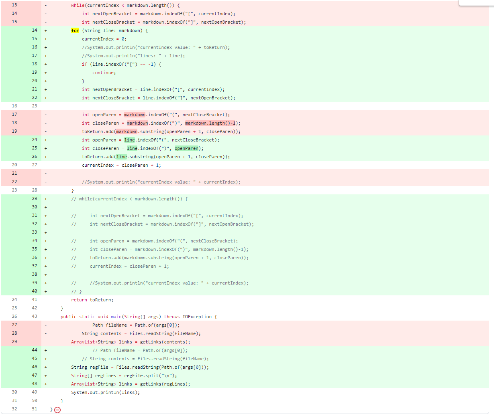
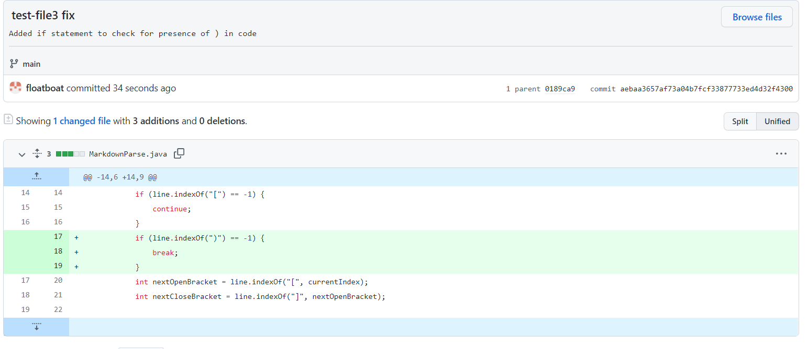
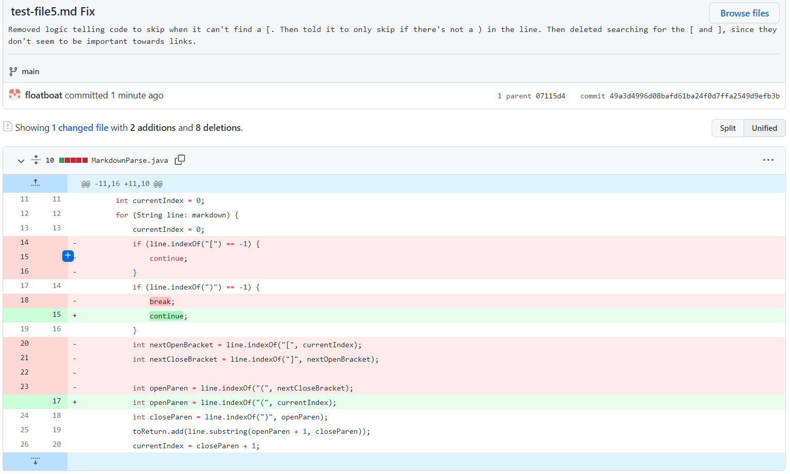

# Lab Report 2, Week 4

[Link to my cse15l-lab-reports page](https://floatboat.github.io/cse15l-lab-reports/)

## Test 1
Code Change: 

Test File: [test-file2.md](https://github.com/floatboat/markdown-parse/blob/main/test-file2.md)

Symptom:
``` 
Exception in thread "main" java.lang.StringIndexOutOfBoundsException: begin 10, end -1, length 33
        at MarkdownParse.getLinks(MarkdownParse.java:23)
        at MarkdownParse.main(MarkdownParse.java:45)
```

Relationship: The bug in of itself was that we had earlier tried to solve the problem of what would happen if there was another `)` that would appear before the end of the actual link. However, we abandoned that test and moved onto trying to process test-file2.md, but didn't revert any old changes. The change that we made to `int closeParen` was that we set it equal to `markdown.indexOf(")", markdown.length()-1)` instead of `markdown.indexOf(")", openParen)`. This meant that our code would start searching for a `)` only 1 character away from the end, where it often wouldn't find the `)`. Thus, the bug would manifest itself (symptom) by showing that `end-1`, as the `indexOf` couldn't find a `)` and thus returned `-1`. The failure inducing input was that there was no `)` only 1 character from the end, meaning that it couldn't find that `)` and thus when it tried to get a `substring`, since `-1` was put in as a value, it would return an error. 

## Test 2
Code Change: 

Test File: [test-file3.md](https://github.com/floatboat/markdown-parse/blob/main/test-file3.md)

Symptom:
```
S C:\Users\thuan\OneDrive\Documents\GitHub\markdown-parse> javac MarkdownParse.java
PS C:\Users\thuan\OneDrive\Documents\GitHub\markdown-parse> java MarkdownParse test-file3.md
Exception in thread "main" java.lang.StringIndexOutOfBoundsException: begin 0, end -1, length 3
        at java.base/java.lang.String.checkBoundsBeginEnd(String.java:4601)
        at java.base/java.lang.String.substring(String.java:2704)
        at MarkdownParse.getLinks(MarkdownParse.java:22)
        at MarkdownParse.main(MarkdownParse.java:30)
```
Relationship: The bug was that the program had no way of telling whether there was actually a link present inside the text or not. Thus, the symptom of the bug was that it would try to find `(` or `)` in the text using `indexOf`, but it couldn't, so it returned a `-1` and would try to get the substring that included `-1`, which isn't right. The failure inducing input itself was that there was no `(` or `)` or a link.

## Test 3
Code Change: 

Test File: [test-file5.md](https://github.com/floatboat/markdown-parse/blob/main/test-file5.md)

Symptom:
```
PS C:\Users\thuan\OneDrive\Documents\GitHub\markdown-parse> java MarkdownParse test-file5.md
[]
```
Relationship: The bug was that the program didn't know how to process a line that only had either a set of `[]` or a set of `()`, where it would skip lines entirely from them not having both. The symptom was that the code would return an empty set, without the link that was actually present in the `()`. The failure inducing input, test-file5.md, had only the set of `[]` and a set of `()` in separate lines. 